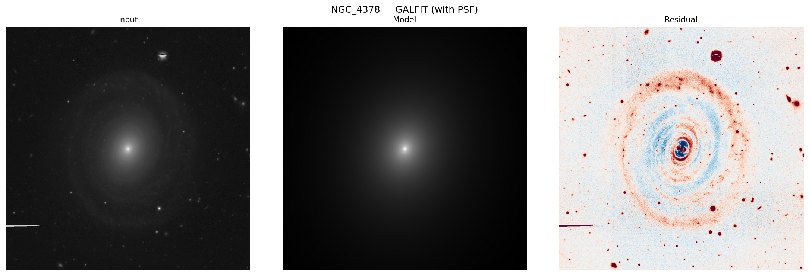
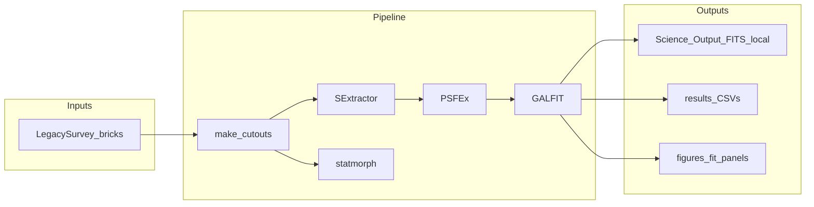

# FRB-Capstone: Galaxy Morphology Pipeline

[](https://www.python.org/)
[](https://www.astropy.org/)
[](LICENSE)

Parametric morphological decomposition of eight nearby galaxies from the **Legacy Survey (DECaLS)** r-band imaging. This pipeline builds science cutouts, derives PSF models with PSFEx, and fits bulge+disk Sérsic profiles with **GALFIT**—with and without PSF deconvolution—to quantify how atmospheric seeing biases recovered structural parameters.

---

## Abstract

Atmospheric PSF convolution systematically **flattens bulge Sérsic indices** and **compresses effective radii** in parametric fits. We demonstrate this across a morphologically diverse sample (E0–Sc) using a reproducible workflow: SExtractor source detection → PSFEx kernel extraction → GALFIT two-component modeling. PSF-corrected fits improve reduced χ² for every galaxy analyzed and recover physically sharper central profiles, with the largest corrections in early-type systems (e.g., NGC 4378: *n* 2.8 → 4.1).

**Representative result (NGC 4378, Sa):**

| | No PSF | With PSF |
|---|---|---|
| Bulge *n* | 2.84 | **4.13** |
| Bulge *R*<sub>e</sub> | 48.9 px | **89.4 px** |
| χ²<sub>ν</sub> | 8.54 | **8.16** |



---

## Table of Contents

- [Key Results](#key-results)
- [Target Sample](#target-sample)
- [Pipeline Overview](#pipeline-overview)
- [Repository Structure](#repository-structure)
- [Prerequisites](#prerequisites)
- [Installation](#installation)
- [Usage](#usage)
- [Data Policy](#data-policy)
- [Documentation](#documentation)
- [Citation](#citation)
- [License](#license)

---

## Key Results

- **PSF impact is universal:** χ²<sub>ν</sub> decreases for all galaxies when the PSF is included ([`results/psf_impact_summary.csv`](results/psf_impact_summary.csv)).
- **Sérsic index bias:** Bulge *n* increases after deconvolution in every case; late-type spirals show minimal change (NGC 3938).
- **Visual QC:** Pre-rendered fit panels in [`figures/fit_panels/`](figures/fit_panels/) and PSF comparison plots in [`figures/psf_comparison/`](figures/psf_comparison/).
- **Full parameter tables:** [`docs/RESULTS_SUMMARY.md`](docs/RESULTS_SUMMARY.md)

---

## Target Sample

| Galaxy | Type | RA (J2000) | Dec (J2000) | Cutout | Notes |
|--------|------|------------|-------------|--------|-------|
| NGC 5846 | E0 | 15h 06m 29.3s | +01° 36′ 20″ | 300″ | Massive elliptical; companion present |
| NGC 5576 | E3 | 14h 21m 14.2s | +03° 15′ 17″ | 300″ | Elliptical; neighbor NGC 5577 |
| NGC 4623 | E7 | 12h 42m 20.9s | +07° 39′ 28″ | 300″ | Edge-on elliptical |
| NGC 3245 | S0 | 10h 27m 18.2s | +28° 30′ 28″ | 300″ | Face-on lenticular |
| NGC 4762 | S0 | 12h 52m 55.8s | +11° 13′ 54″ | 300″ | Edge-on lenticular; thin disk |
| NGC 4378 | Sa | 12h 25m 18.1s | +04° 55′ 31″ | 300″ | Spiral with prominent bulge |
| NGC 4814 | Sb | 12h 55m 32.1s | +58° 19′ 44″ | 300″ | Spiral |
| NGC 3938 | Sc | 11h 52m 49.4s | +44° 07′ 15″ | **500″** | Face-on spiral; extended arms |

A pilot analysis of **NGC 3379** is preserved under [`NGC_3379_Analysis/`](NGC_3379_Analysis/).

---

## Pipeline Overview



| Phase | Tool | Output |
|-------|------|--------|
| 1. Cutouts | `make_cutouts.py` | `*_r_cutout.fits`, `*_r_sigma_cutout.fits` |
| 2. Catalog | SExtractor | `*.ldac`, `segmentation.fits` |
| 3. PSF | PSFEx + `extract_psf_batch.py` | `PSF_Output/*_final_psf.fits` |
| 4. Priors | `run_statmorph.py`, `extract_initial_guesses.py` | `results/*.csv` |
| 5. Modeling | GALFIT | `*_galfit_{nopsf,withpsf}.fits`, fit logs |
| 6. QC | `generate_fit_panels.py`, `compare_psf_impact.py` | `figures/` PNGs |

---

## Repository Structure

```text
FRB-capstone/
├── README.md                 # This file
├── requirements.txt          # Python dependencies
├── config/                   # Canonical SExtractor, PSFEx, GALFIT templates
│   ├── sextractor/
│   ├── psfex/
│   └── galfit/
├── docs/                     # Extended documentation and capstone PDF
├── Scripts/                  # Pipeline automation (Python + PowerShell helpers)
├── Notebooks/                # Exploratory notebooks
├── results/                  # CSV summaries (git-tracked)
├── figures/                  # QC PNG panels (git-tracked)
│   ├── fit_panels/
│   └── psf_comparison/
├── NGC_*_Analysis/           # Per-galaxy science trees (FITS gitignored)
│   ├── Input_Bricks/
│   ├── Configuration/
│   ├── Science_Output/
│   └── _working/             # GALFIT iteration artifacts (gitignored)
└── NGC_3379_Analysis/        # Pilot galaxy (legacy)
```

> **Note:** Large FITS files and survey bricks are excluded from git via [`.gitignore`](.gitignore). Clone the repo for code and configs; place science data locally under each `NGC_*_Analysis/` folder.

---

## Prerequisites

| Component | Purpose |
|-----------|---------|
| **Windows 10/11** | Host OS (scripts use WSL path bridging) |
| **WSL (Debian)** | Runs compiled astronomy tools |
| **Conda env `frb_project`** | Python stack + tool environment in WSL |
| **SExtractor** | Source detection and photometry |
| **PSFEx** | Spatially varying PSF modeling |
| **GALFIT** | Parametric 2D fitting |
| **SAOImage DS9** | Optional FITS inspection (PowerShell helpers provided) |

---

## Installation

```bash
# Clone the repository
git clone https://github.com/<your-org>/FRB-capstone.git
cd FRB-capstone

# Python environment (Windows or WSL)
python -m venv .venv
.venv\Scripts\activate        # Windows
pip install -r requirements.txt
```

Install SExtractor, PSFEx, and GALFIT in WSL and activate the conda environment:

```bash
conda activate frb_project
```

Download DECaLS r-band bricks for each target into the appropriate `NGC_*_Analysis/Input_Bricks/` directory from the [Legacy Survey](https://www.legacysurvey.org/) cutout service or brick archive.

---

## Usage

Run from the repository root. Batch scripts invoke WSL automatically for compiled tools.

```bash
# 1. Organize downloaded bricks into galaxy folders
python Scripts/organize_bricks.py

# 2. Build centered cutouts and sigma maps
python Scripts/make_cutouts.py

# 3. Source detection
python Scripts/run_sextractor_batch.py

# 4. PSF modeling
python Scripts/run_psfex.py
python Scripts/extract_psf_batch.py

# 5. Initial parameter estimates
python Scripts/extract_initial_guesses.py
python Scripts/run_statmorph.py

# 6. Generate GALFIT feedme files and run fits
python Scripts/generate_galfit_feedme.py
python Scripts/run_galfit_batch.py

# 7. Quality control and reporting
python Scripts/generate_fit_panels.py --variant both
python Scripts/compare_psf_impact.py
```

### Per-galaxy utilities

```bash
# Verify SExtractor segmentation
python Scripts/verify_galaxy.py --galaxy NGC_4378

# Check PSF star candidates
python Scripts/check_psf_candidates.py --galaxy NGC_4378

# Export a shareable data package (local only)
python Scripts/populate_data_package.py
```

---

## Data Policy

| Tracked in git | Local only (`.gitignore`) |
|----------------|---------------------------|
| Python scripts, configs | `Input_Bricks/*.fits.fz` |
| CSV summaries in `results/` | Science FITS in `Science_Output/` |
| QC PNGs in `figures/` | PSFEx diagnostics, GALFIT iterations in `_working/` |
| Documentation | `archive/`, `Google_Drive_Data_Package/` |

Regenerate visual panels from local FITS after cloning:

```bash
python Scripts/generate_fit_panels.py --variant both
python Scripts/compare_psf_impact.py
```

---

## Documentation

| Document | Description |
|----------|-------------|
| [`docs/PIPELINE_GUIDE.md`](docs/PIPELINE_GUIDE.md) | Master technical guide: configs, progress log, GALFIT strategy |
| [`docs/RESULTS_SUMMARY.md`](docs/RESULTS_SUMMARY.md) | Final fit parameter tables (No PSF vs With PSF) |
| [`docs/capstone_project_morphology_fitting.pdf`](docs/capstone_project_morphology_fitting.pdf) | Formal capstone write-up |

---

## Citation

If you use this pipeline or results, please cite the underlying tools and data:

- **GALFIT:** Peng et al. (2010), [*AJ* **139**, 2097](https://doi.org/10.1088/0004-6256/139/5/2097)
- **SExtractor:** Bertin & Arnouts (1996), [*A&AS* **117**, 393](https://doi.org/10.1051/aas:1996164)
- **PSFEx:** Bertin (2011), in *Astronomical Data Analysis Software and Systems XX*, ASP Conf. Ser. 442, 435
- **Legacy Survey / DECaLS:** Dey et al. (2019), [*AJ* **157**, 168](https://doi.org/10.3847/1538-3881/ab089d)
- **statmorph:** Rodriguez-Gomez et al. (2019), [*MNRAS* **484**, 2636](https://doi.org/10.1093/mnras/stz007)

---

## License

Pipeline code is released under the [MIT License](LICENSE). Legacy Survey data are subject to the [Legacy Survey terms of use](https://www.legacysurvey.org/terms/).

---

<p align="center">
  <sub>Capstone project — multi-galaxy morphology analysis with PSF-corrected GALFIT decomposition.</sub>
</p>
